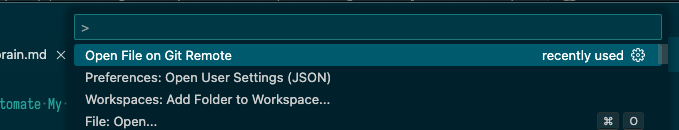
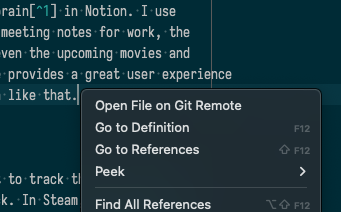
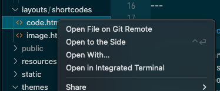

# open-file-on-git-remote README

A simple command that allows you to open any file that is tracked in your remote
repo in a web browser.

This extension supports the following features:

- [Open File On Git Remote -- Command Palette](#open-file-on-git-remote----command-palette)
- [Open File on Git Remote -- Text Editor Context Menu](#open-file-on-git-remote----text-editor-context-menu)
- [Open File on Git Remote -- File Explorer Context Menu](#open-file-on-git-remote----file-explorer-context-menu)

## Inspiration

The inspiration behind this comes from all the times I've looked up code quickly
in VSCode, and wanted to share a link to it to a colleague and had to then search
for the same file in the web version of the repository. This removes that step
and automatically opens the same file, on the same branch in the web browser
based on the repo's git config settings.

## Features

### Open File On Git Remote -- Command Palette

This extension supplies a command in the Command Palette called
"Open File on Git Remote" that, when executed, opens the file that's currently
active in the text editor in the git repository service's website. In the web
browser, it will open the same file in the same branch that you have open in
VSCode.

The "Open File on Git Remote" command automatically supports opening any file
in the following popular git repository services:

- https://github.com
- https://bitbucket.org
- https://gitlab.com

#### What if I use a custom git repository service?

If your repo is not hosted on any of the popular services listed above, fear not,
for you can use a setting called `open-file-on-git-remote.customUrl`. See
[Extension Settings](#extension-settings) below.

### Open File on Git Remote -- Text Editor Context Menu

Additionally, you can access the "Open File on Git Remote" command from the
context menu in an active text editor. To do this, simply right click on a text
editor, and select the "Open File on Git Remote" command from the menu.

### Open File on Git Remote -- File Explorer Context Menu

Finally, you can access the "Open File on Git Remote" command from the
context menu in the file explorer. To do this, simply right click on a file in
file explorer, and select the "Open File on Git Remote" command from the menu.

## Requirements

The file you're attemping to open should be tracked in a git repository and that
repository should be hosted on a git repository service.

## Extension Settings

This extension contributes a single optional setting:

- `open-file-on-git-remote.customUrl`: custom web url to remote git repository service.

The `customUrl` setting should be set if your repo is not hosted on one of the
popular services listed above. `customUrl` should be a url that is the shape
of your service's Url structure for viewing a specific file on the site.

In order to support `customUrl`s of any shape, there are a few supported variables
that you can supply to your `customUrl`:

- `${webUrl}`: Use the same web host url that is define in your .git/config file
- `${branch}`: The current branch that you're currently working on
- `${relativePath}`: The file path relative to the repo's root URI

So, for example, github's `customUrl` would look something like this:
`${webUrl}/blob/${branch}/${relativePath}`

**Pro Tip**: Use workspace-specific settings if your custom url can't make use of
`${webUrl}` because typically that's where the project and repo name are located.

## Known Issues

N/A

## Release Notes

### 0.0.1

Initial release of open-file-on-git-remote extension

### 0.0.2

Added command to right-click menu in the text editor and the file explorer.
Also cleaned up code and added more logs to the OutputChannel

### 0.0.3

Readme updates & images

---
